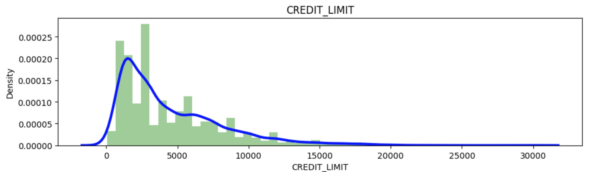
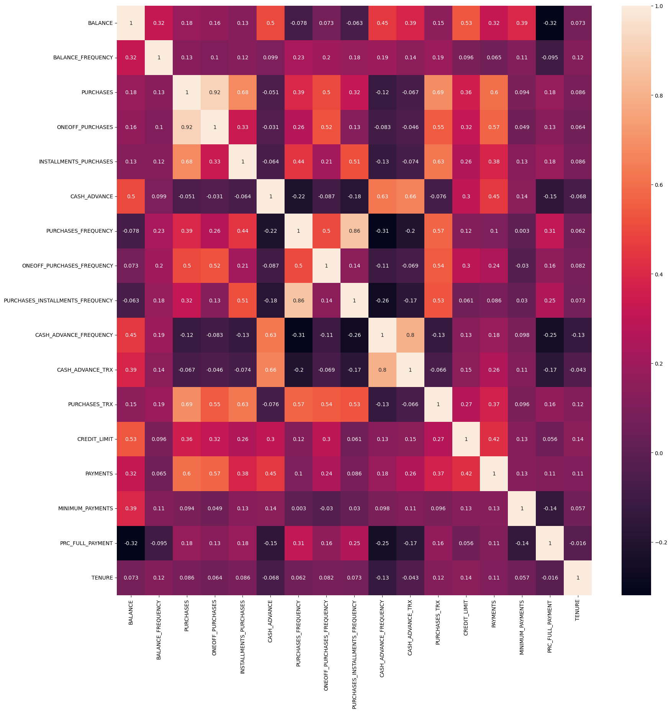
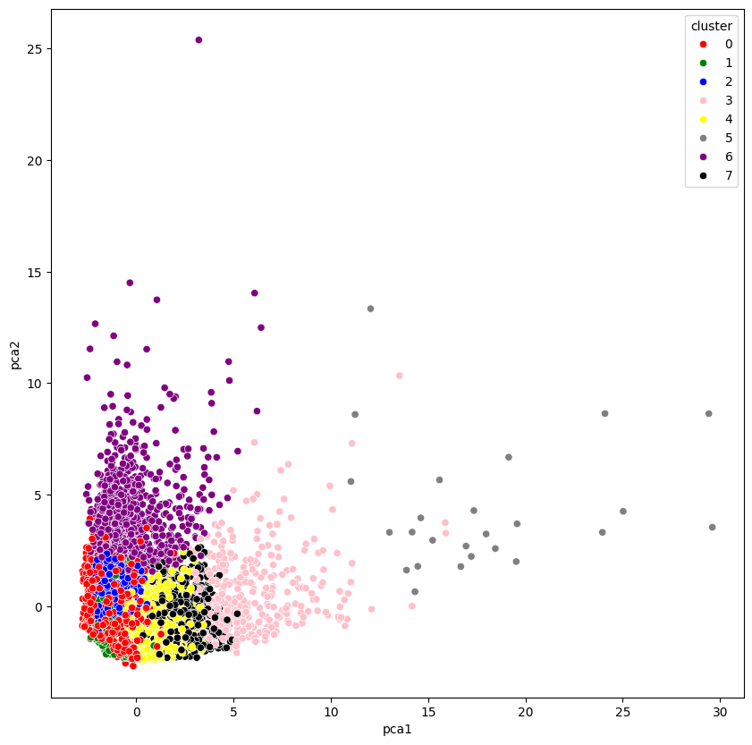

# Marketing-Project

---
       

## Introduction
This project focuses on using data science to address a key challenge in marketing area. The idea is to make possible campaigns more targeted and relevant, leading to better results. If the goal of a marketing campaign is to communicate a message to customers, is essencial to address the message to the desired target.

## Problem Statement
This project addresses the problem by developing a machine learning model that segments customers into different groups for future marketing campaigns.

## Background
- Import libraries and datasets
- Visualize dataset
- Data cleaning and exploration
- Exploratory Data Analysis (EDA)
- Definition of numbers of clusters
- K-Means
- Principal Components Analysis (PCA)
- Dimesionality Reduction Using Autoencoders
- Final Model

## Models Used
- Principal Component Analysis (PCA)
- Autoencoders
- K-Means

## Data Sourcing
The dataset used in this project is a cleaned version of information extracted from the internet. 

## Data Cleaning and Exploration
The data was previously cleaned with a first ETL process, the last changes produced to it were:
1) To drop null values in MINIMUM_PAYMENT and CREDIT_LIMIT.
2) To remove unnecessary column such as CUST_ID.
3) To scale all the dataset.

## Exploratory Data Analysis (EDA)
In this step, the principal objective was to:
- To use KDE Plot  for visualizating the probability density of each variable (example).
  
- To graph and understand other correlations in values.
  
  
## Definition of Number of Clusters
Using K-Means the main objective here is to find the number of clusters necessary for data classification. In the first try, the optimal number is 8 clusters. After this, I defined a center for each cluster.

## Principal Components Analysis (PCA)
After graphing each value represented with the respective clusters, we can see that the results are not so good. The classification is a little distorted.
 
Next step is to reduce the data's dimension for optimizating the processing.

## Dimensionality Reduction
In this step, I try to reduce the dimensinality of the data with keras and tensorflow designing a neuronal network that encoded and decoded again each feature reducing the number of features (Autoencoders). 
Next step I to check if this reduction is good for data clustering. Let's try with K-Means again.

---
An autoencoder reduces the dimensionality of the data, not the number of clusters. Here's a breakdown:

Reducing Data Dimensionality: An autoencoder learns a compressed, lower-dimensional representation of the input data through its hidden layers. The goal is to represent the essential features of the data in fewer dimensions, making it easier for algorithms like K-means to find meaningful patterns.

K-means Clustering: After the dimensionality reduction, K-means is applied to the compressed data to form clusters. The number of clusters is still determined by K-means, based on the number of groups you define, not by the autoencoder.

In short, the autoencoder reduces the number of features (dimensionality), while K-means finds clusters in the reduced data.
---

