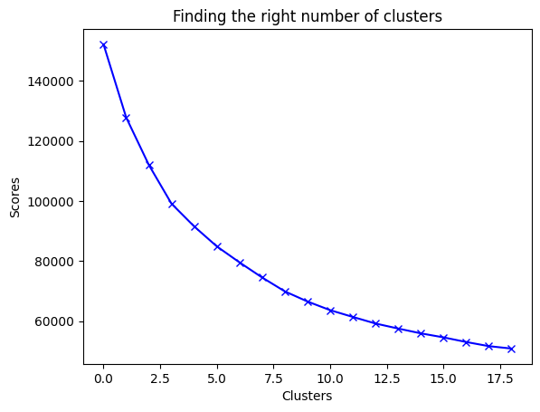
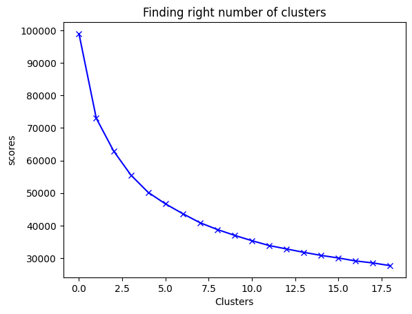
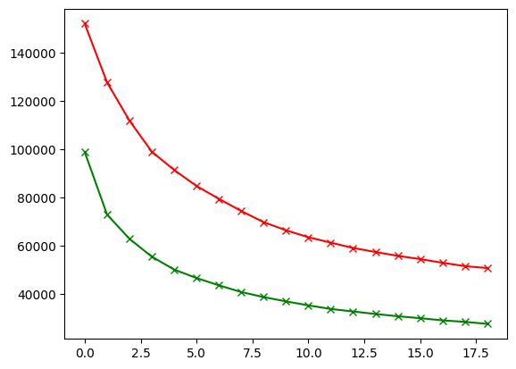
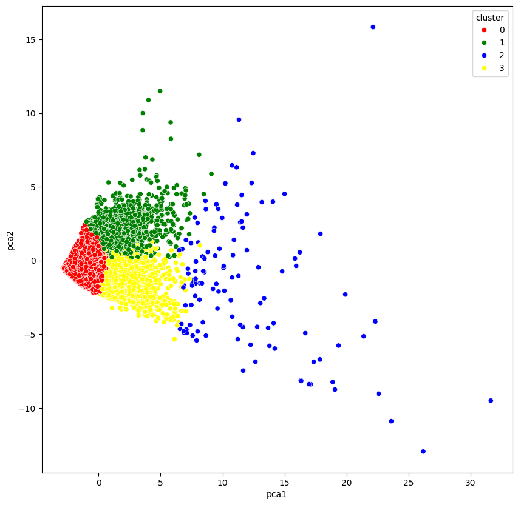

# Marketing-Project

---
       

## Introduction
This project focuses on using data science to address a key challenge in marketing area. The idea is to make possible campaigns more targeted and relevant, leading to better results. If the goal of a marketing campaign is to communicate a message to customers, is essencial to address the message to the desired target.

## Problem Statement
This project addresses the problem by developing a machine learning model that segments customers into different groups for future marketing campaigns.

## Background
- Import libraries and datasets
- Visualize dataset
- Data cleaning and exploration
- Exploratory Data Analysis (EDA)
- Definition of numbers of clusters
- K-Means
- Principal Components Analysis (PCA)
- Dimesionality Reduction Using Autoencoders
- Final Model

## Models Used
- Principal Component Analysis (PCA)
- Autoencoders
- K-Means

## Data Sourcing
The dataset used in this project is a cleaned version of information extracted from the internet. 

## Data Cleaning and Exploration
The data was previously cleaned with a first ETL process, the last changes produced to it are:
1) To drop null values in MINIMUM_PAYMENT and CREDIT_LIMIT.
2) To remove unnecessary column such as CUST_ID.
3) To scale all the dataset.

## Exploratory Data Analysis (EDA)
In this step, the principal objective is to:
- Use KDE Plot  for visualizating the probability density of each variable (example).
  
- Graph and understand other correlations in values.
  
  
## Definition of Number of Clusters
Using K-Means the main objective here is to find the number of clusters necessary for data classification. In the first try, the optimal number is 8 clusters. After this, I defined a center for each cluster.

 

## Principal Components Analysis (PCA)
After graphing each value represented with the respective clusters, we can see that the results are not so good. The classification is a little distorted.

 
Next step is to reduce the data's dimension for optimizating the processing.

## Dimensionality Reduction
In this step, I try to reduce the dimensinality of the data with keras and tensorflow designing a neuronal network that encoded and decoded again each feature reducing the number of features (Autoencoders). 
Next step I to check if this reduction is good for data clustering. Looking at this K-Means, the right number of cluster in this case will be 4.

 

Comparating the scores for each case, definitely using 4 or 5 clusters and with the reduction of data dimensionality is more efficient the model.

 

 ## Final Model
The final steps are to assign center point to each cluster and to graph the results. Each value is better segmented this time.

 
